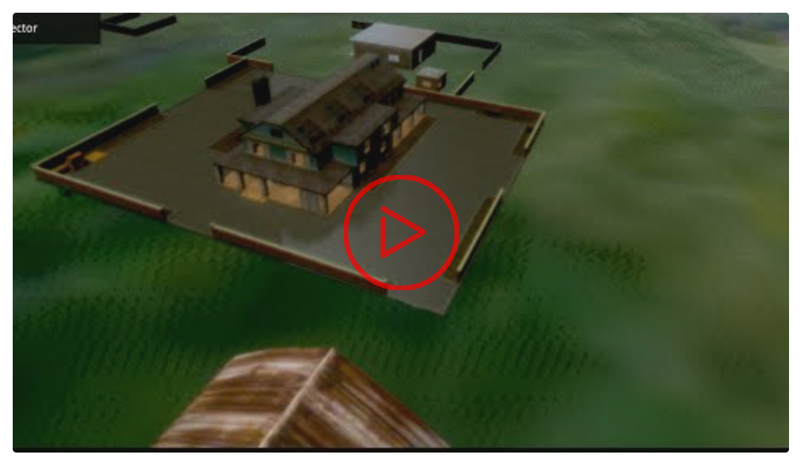

---

# NexosYT - Lazy YouTube Player



Lazy YouTube Player is a lightweight, customizable YouTube player component with support for React, Vue, and Svelte. It provides a simple way to embed YouTube videos with lazy loading capabilities, improving your website's performance.

---

### Features

- Lazy loading of YouTube videos
- Support for React, Vue, and Svelte
- Customizable player options
- TypeScript support
- Smooth transitions and hover effects
- Responsive design

---

### Links

[](https://nexoscreator.github.io/lazy-youtube-player)
[](https://github.com/nexoscreator/lazy-youtube-player)
[](https://youtu.be/rMnDe0iEGRs?si=B2viVesOhHYusbBG)

---

### Installation

Choose the package that corresponds to your framework:

### React

```bash
npm install @lazy-youtube-player/react
```

### Vue

```shellscript
npm install @lazy-youtube-player/vue
```

### Svelte

```shellscript
npm install @lazy-youtube-player/svelte
```

### Vanilla
```html
<script src="https://cdn.jsdelivr.net/gh/nexoscreator/lazy-youtube-player@v0.0.1/yt-player.min.js" defer></script>

<link rel="stylesheet" href="https://cdn.jsdelivr.net/gh/nexoscreator/lazy-youtube-player@v0.0.1/yt-player.min.css">
```

---

## Usage

### React

```javascriptreact
import React from 'react';
import LazyYoutubePlayerComponent from './components/LazyYoutubePlayerComponent';

function App() {
  return (
    <div className="App">
      <LazyYoutubePlayerComponent videoId="9FubrG9p3kc" />
    </div>
  );
}

export default App;
```

### Vue or Nuxt 3

```vue
<template>
  <LazyYoutubePlayer videoId="9FubrG9p3kc" />
</template>

<script setup>
import LazyYoutubePlayer from '~/components/LazyYoutubePlayer.vue';
</script>
```

### Svelte

```svelte
<script>
  import LazyYoutubePlayer from './components/LazyYoutubePlayer.svelte';
</script>

<LazyYoutubePlayer videoId="9FubrG9p3kc" />
```

### Vanilla
  ```html
  <div class="NexosYt" data-embed="YT_VIDEO_ID"></div>
  ```

---

## API

The LazyYoutubePlayer component accepts the following props:

- `videoId` (string, required): The YouTube video ID.
- `width` (number, optional): The width of the player. Default: 640.
- `height` (number, optional): The height of the player. Default: 360.
- `autoplay` (boolean, optional): Whether to autoplay the video. Default: false.

---

### Contributing
Contributions are welcome! If you have any suggestions, bug fixes, or improvements, feel free to open an issue or submit a pull request.
If you'd like to contribute to this project, please follow these ste

1. Fork the repository.
2. Create a new branch (`git checkout -b feature/improvement`).
3. Make your changes and commit them (`git commit -m 'Add feature/improvement'`).
4. Push to the branch (`git push origin feature/improvement`).
5. Open a Pull Request.

Please check the [CONTRIBUTING.md](CONTRIBUTING.md) file for more details.

---

### License

This project is licensed under the [MIT License](LICENSE).